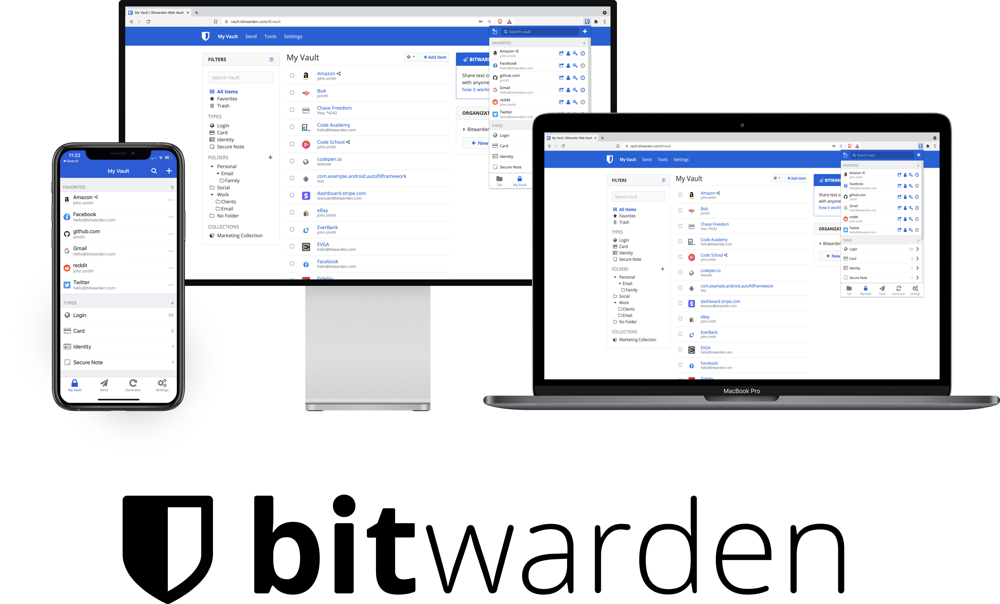

<p align="center">
  
</p>

# [Vaultwarden](https://github.com/dani-garcia/vaultwarden)

_用 Rust 编写的非官方 Bitwarden 兼容服务器，以前称为 bitwarden_rs。本项目是vaultwarden的云开发应用版_

## 使用

点击下方按钮即可使用

## 部署

本项目基于腾讯开源项目 [CloudBase Framework](https://github.com/Tencent/cloudbase-framework) [](https://github.com/Tencent/cloudbase-framework) 开发部署，支持一键云端部署


[](https://console.cloud.tencent.com/tcb/env/index?&action=CreateAndDeployCloudBaseProject&appUrl=https://github.com/james-curtis/vaultwarden-cloudbase&branch=$master)

### 配置

_如果应用安装时有自定义参数需要用户填写，可以声明[环境变量](https://docs.cloudbase.net/framework/config.html#requirement)，同时在下方进行参数的描述_

- SIGNUPS_ALLOWED，默认true 控制新用户是否可以注册
- INVITATIONS_ALLOWED，默认true 允许管理员邀请用户，即使注册被禁用

配置参考：https://github.com/dani-garcia/vaultwarden/blob/main/.env.template

### 依赖


- CFS：共享文件存储服务。需要使用 CFS 持久化配置数据

## 开发

你也可以下载项目后，使用 [CloudBase CLI](https://docs.cloudbase.net/cli-v1/intro.html) 在终端中一键部署。

```
npx @cloudbase/cli framework deploy -e 环境id
```

## 注意事项

1. _这里填写注意事项_
2. _这里填写注意事项_

## 文档

- [CloudBase Framework 文档](https://docs.cloudbase.net/framework/)
- [Vaultwarden Wiki](https://github.com/dani-garcia/vaultwarden/wiki)
